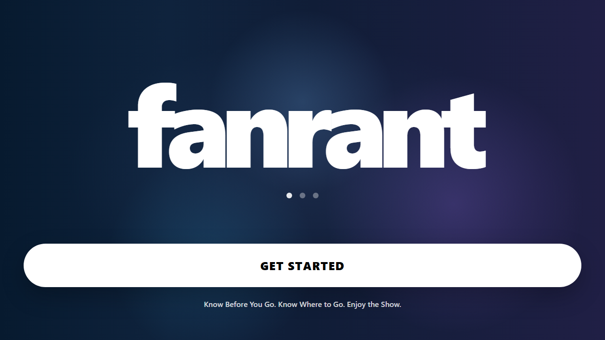
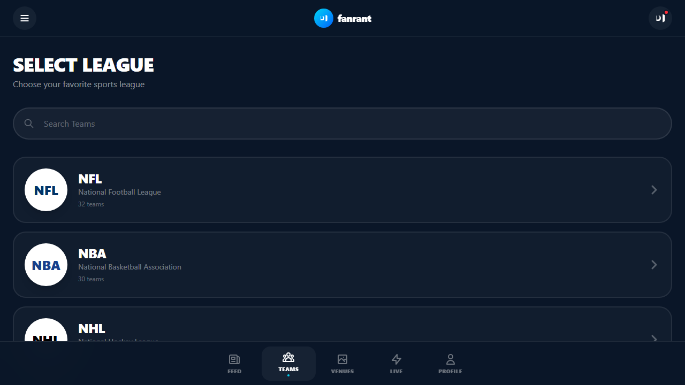
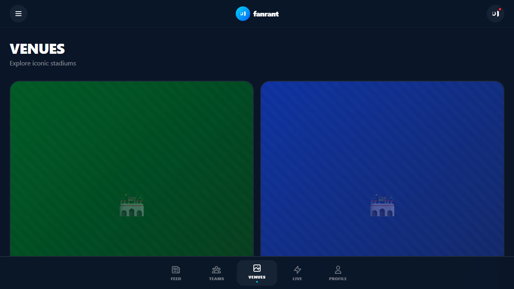
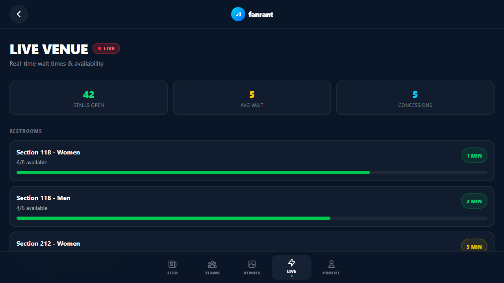
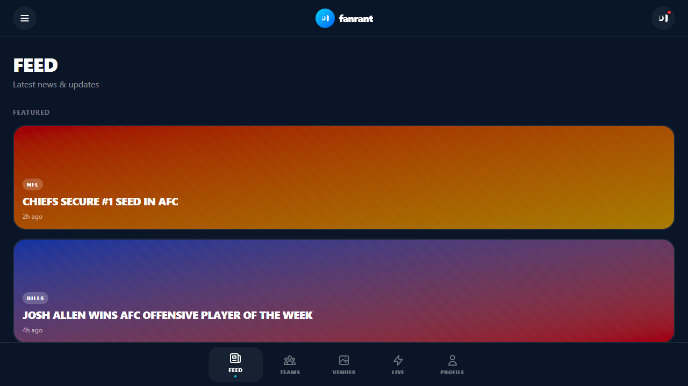
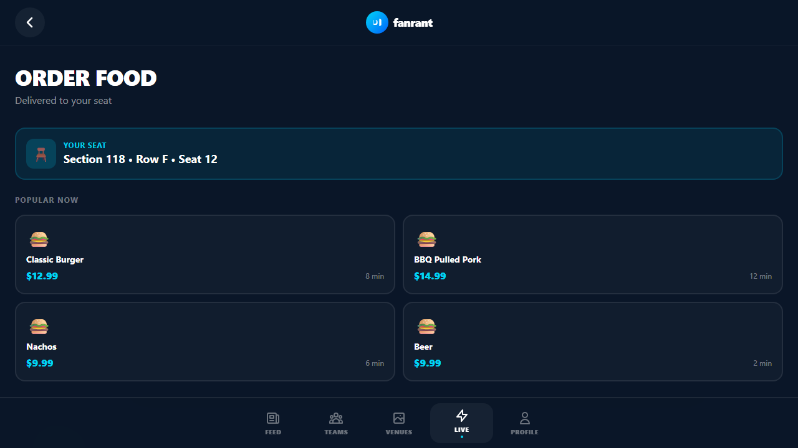

# FanRant

FanRant is a sports fan experience app built with React, Vite, and TypeScript. It gives fans a way to browse teams, follow live venue activity, find concessions, stream match moments, and stay connected to the game-day atmosphere.

## Features

- Team discovery and league browsing for NFL teams
- Team detail pages with standout stats and highlights
- Venue and stadium exploration
- Live venue experience and map-inspired navigation
- Food ordering flow for stadium concessions
- Video player experience for fan content and action replays
- Social-style feed for updates and moments
- Clean, mobile-first UI designed for game-day engagement

## Tech Stack

- React 18
- Vite
- TypeScript
- React Router
- Framer Motion
- Tailwind CSS

## Getting Started

1. Install dependencies:

   npm install

2. Start the development server:

   npm run dev

3. Build for production:

   npm run build

## Project Structure

```text
src/
  components/
  pages/
  App.tsx
  main.tsx
public/
  none
```

## Screenshots

### Title screen


### Home screen



### Sports browsing



### Venue discovery



### Live venue experience



### Fan feed



### Food ordering



## Notes

This project is a polished front-end prototype created to showcase a modern sports fan journey from entry to live stadium engagement. It is designed to be easy to extend with real APIs, authentication, or backend services.
